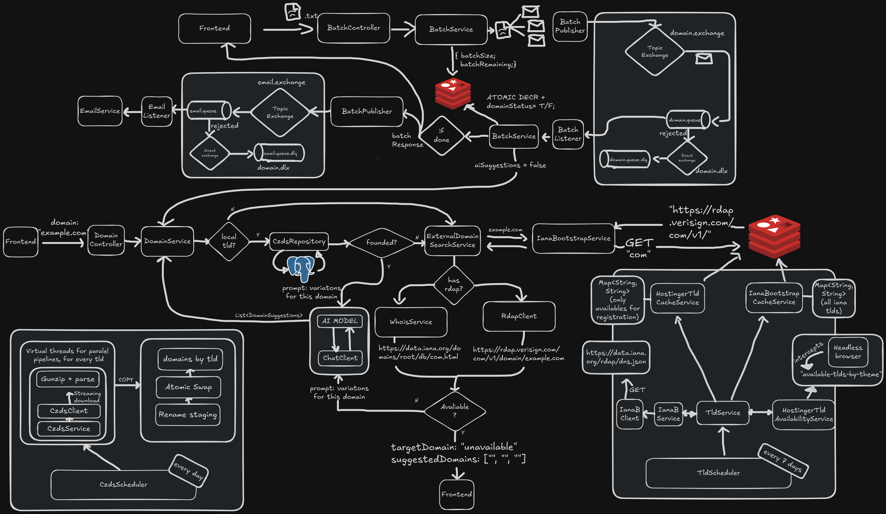

# Sterna

Backend em Spring Boot para consulta de disponibilidade de domínios, com busca direta em RDAP, fallback para WHOIS, sugestões por IA, autenticação Google, cache em Redis e processamento assíncrono com RabbitMQ.

## Visão geral

O projeto centraliza a validação de domínios e o fluxo de batch em uma API REST. Quando o domínio não está disponível, o serviço pode gerar variações com IA e testar cada sugestão individualmente.

Também há integração com:

- **MongoDB** para usuários autenticados.
- **Redis** para cache de TLDs e resultados de batch.
- **RabbitMQ** para desacoplar o processamento do batch e o envio de e-mail.
- **SMTP/Thymeleaf/PDF** para notificação do resultado do batch por e-mail com anexo PDF.
- **Feign** para integrações externas.
- **Playwright** para coletar os TLDs disponíveis na Hostinger.

## Arquitetura


Arquivo de apoio para apresentação: `backend/docs/roteiro-arquitetura.md`

## Principais fluxos

### Consulta de domínio

1. `DomainController` recebe `POST /api/domains/{domain}`.
2. `DomainService` resolve o RDAP correto a partir do TLD.
3. Se houver RDAP, a API consulta o servidor oficial.
4. Se não houver RDAP, o fluxo usa WHOIS.
5. Se o domínio estiver indisponível e a opção estiver habilitada, a IA gera variações próximas.

### Batch de domínios

1. `BatchController` recebe uma lista em texto ou um arquivo `.txt`.
2. `BatchService` valida o conteúdo e publica eventos no RabbitMQ.
3. `BatchListener` processa cada domínio e acumula o resultado no Redis.
4. Quando o lote termina, `BatchNotificationListener` gera um PDF e envia por e-mail.

### Bootstrapping de TLDs

1. `IanaBootstrapService` lê o bootstrap da IANA.
2. Os TLDs e seus servidores RDAP são armazenados no Redis.
3. `HostingerTldAvailabilityService` complementa a base com os TLDs capturados da Hostinger.

## Endpoints

### Domínios

- `POST /api/domains/{domain}?withAiSuggestions=true|false`

### Batch

- `POST /api/batch/text`
- `POST /api/batch/file`

### Autenticação

- `GET /oauth2/authorization/google`
- `GET /api/auth/me`
- `POST /auth/logout`

### Admin

- `GET /api/admin/ianaBootstrap`
- `POST /api/admin/ianaBootstrap/refresh`

## Estrutura principal

```text
src/main/java/com/domainsugester/domain_finder/
├── auth/        # OAuth2 e usuário autenticado
├── batch/       # Batch, RabbitMQ, PDF e e-mail
├── domain/      # Consulta de disponibilidade
├── iana/        # Bootstrap e cache de TLDs
├── registrar/   # Integrações com Hostinger
├── tld/         # Serviços de TLD e refresh do bootstrap
├── whois/       # Fallback WHOIS
├── ai/          # Geração de variações com IA
├── mail/        # Envio de e-mail
└── shared/      # Configurações gerais
```

## Como executar

### Pré-requisitos

- Java 21
- Maven
- Redis
- RabbitMQ
- MongoDB
- Conta Google OAuth2
- Chave da API do Gemini
- Servidor Playwright rodando em `ws://localhost:3000`

### Passos

1. Entre na pasta do backend:

```bash
cd backend
```

2. Configure o `.env` com base em `.env.example`.
3. Suba a infraestrutura local:

```bash
docker-compose up -d
```

4. Execute a aplicação:

```bash
./mvnw spring-boot:run
```

## Variáveis de ambiente

As principais variáveis usadas pela aplicação são:

- `MONGO_URI`
- `REDIS_HOST`
- `REDIS_PORT`
- `IANA_BASE_URL`
- `IANA_DATA_BASE_URL`
- `GOOGLE_CLIENT_ID`
- `GOOGLE_CLIENT_SECRET`
- `ICANN_ACCOUNT_USERNAME`
- `ICANN_ACCOUNT_PASSWORD`
- `CZDS_DIRECTORY`
- `RABBITMQ_HOST`
- `RABBITMQ_PORT`
- `RABBITMQ_USERNAME`
- `RABBITMQ_PASSWORD`
- `GMAIL_USERNAME`
- `GMAIL_APP_PASSWORD`
- `GEMINI_API_KEY`

## Roteiro de vídeo

Veja `backend/docs/roteiro-arquitetura.md` para um roteiro curto, em português, pensado para gravação de até 8 minutos.
